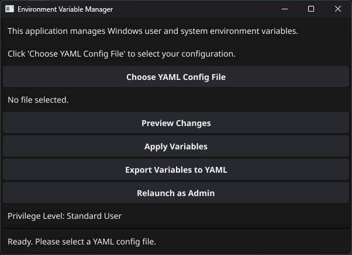
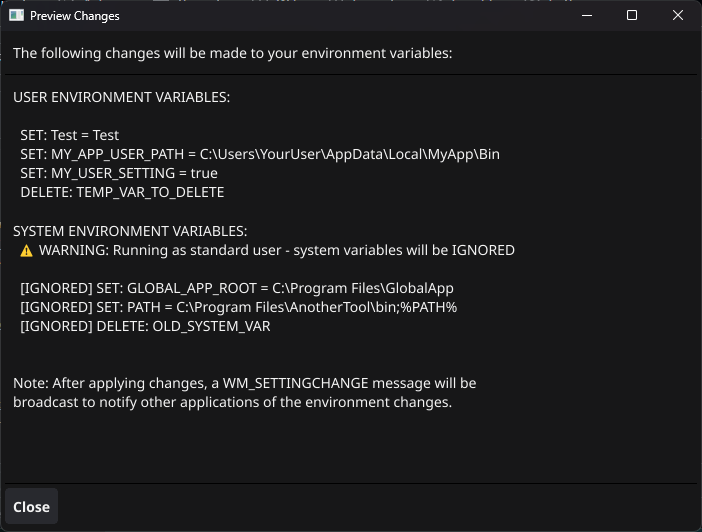
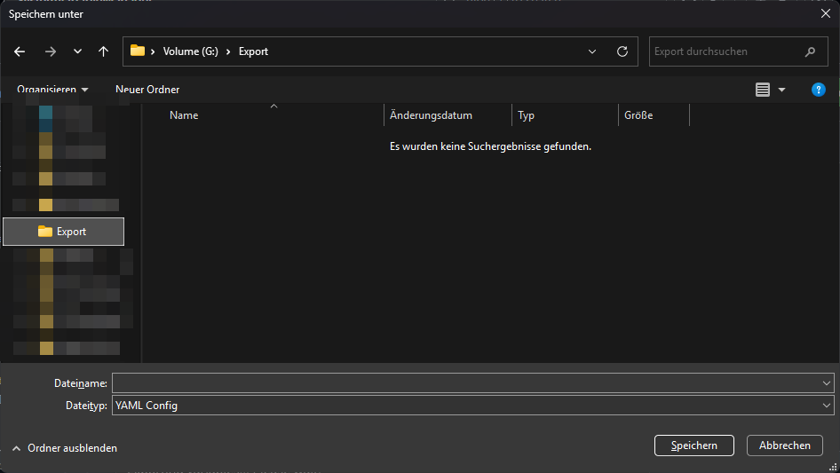
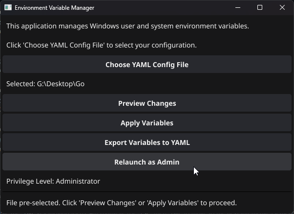

# Environment Variable Manager

A Windows GUI application for managing user and system environment variables with YAML configuration support. Built with Go and Fyne, this tool provides an intuitive interface for bulk environment variable operations and supports importing/exporting configurations.

## Features

### Core Functionality
- **Bulk Environment Variable Management** - Apply multiple environment variables at once from YAML configuration files
- **User & System Variables** - Manage both user-specific and system-wide environment variables
- **Import/Export Support** - Import variables from YAML files and export current variables to YAML format
- **Preview Changes** - Review all pending changes before applying them to your system
- **Administrator Privilege Detection** - Automatically detects admin status and handles UAC elevation
- **Real-time Status Updates** - Get immediate feedback on all operations with detailed status messages

### Advanced Features
- **YAML Configuration Format** - Human-readable configuration files with support for both `.yaml` and `.yml` extensions
- **Operation Types** - Support for both `set` (create/update) and `delete` operations
- **Automatic Notifications** - Broadcasts `WM_SETTINGCHANGE` messages to notify other applications of changes
- **Command Line Support** - Pass configuration files as command line arguments
- **Dark Theme Interface** - Modern dark-themed GUI built with Fyne
- **Error Handling** - Comprehensive error handling with detailed error messages and user-friendly dialogs

### Safety & Security
- **Preview Mode** - Always preview changes before applying them
- **Admin Privilege Management** - Secure UAC elevation when system variables need modification
- **File Validation** - Validates YAML files before processing
- **Registry Safety** - Safe registry operations with proper error handling

## Requirements

- **Operating System**: Windows (Vista/7/8/10/11)
- **Architecture**: x64
- **Privileges**: 
  - Standard user privileges for user environment variables
  - Administrator privileges for system environment variables

## Installation

### Option 1: Download Release Binary
1. Go to the [Releases](../../releases) page
2. Download the latest `SystemVariableManager.exe`
3. Run the executable directly (no installation required)

### Option 2: Build from Source
```bash
# Clone the repository
git clone https://github.com/LewdLillyVT/SystemVariableManager.git
cd SystemVariableManager

# Install dependencies
go mod tidy

# Build the application
go build -o SystemVariableManager.exe main.go
```

### Dependencies
The following Go modules are required:
- `fyne.io/fyne/v2` - GUI framework
- `github.com/sqweek/dialog` - Native file dialogs
- `golang.org/x/sys/windows/registry` - Windows registry access
- `gopkg.in/yaml.v2` - YAML parsing

## Usage

### Basic Workflow
1. **Launch the Application** - Double-click `SystemVariableManager.exe`
2. **Choose Configuration** - Click "Choose YAML Config File" to select your configuration
3. **Preview Changes** - Click "Preview Changes" to review what will be modified
4. **Apply Variables** - Click "Apply Variables" to make the changes
5. **Restart Applications** - Restart applications that need the new environment variables

### YAML Configuration Format

Create a YAML file with the following structure:

```yaml
user_variables:
  - name: "MY_USER_VAR"
    value: "user_value"
    operation: "set"
  - name: "OLD_USER_VAR"
    value: ""
    operation: "delete"

system_variables:
  - name: "MY_SYSTEM_VAR"
    value: "system_value"
    operation: "set"
  - name: "OLD_SYSTEM_VAR"
    value: ""
    operation: "delete"
```

### Operations
- **`set`** - Creates a new environment variable or updates an existing one
- **`delete`** - Removes an existing environment variable

### Running as Administrator
For system environment variables, administrator privileges are required:
1. Click "Relaunch as Admin" button in the application, or
2. Right-click the executable and select "Run as administrator"

### Command Line Usage
```bash
# Launch with a pre-selected configuration file
SystemVariableManager.exe "path\to\config.yaml"
```

## Examples

### Example 1: Development Environment Setup
```yaml
user_variables:
  - name: "GOPATH"
    value: "C:\\Users\\YourName\\go"
    operation: "set"
  - name: "NODE_ENV"
    value: "development"
    operation: "set"

system_variables:
  - name: "JAVA_HOME"
    value: "C:\\Program Files\\Java\\jdk-17"
    operation: "set"
```

### Example 2: Cleanup Old Variables
```yaml
user_variables:
  - name: "DEPRECATED_VAR"
    value: ""
    operation: "delete"
  - name: "OLD_PATH_COMPONENT"
    value: ""
    operation: "delete"
```

## Troubleshooting

### Common Issues

**"System variables were ignored" message**
- **Cause**: Application is running without administrator privileges
- **Solution**: Click "Relaunch as Admin" or run as administrator

**"Error reading YAML file" message**
- **Cause**: Invalid YAML syntax or file permissions
- **Solution**: Validate your YAML syntax and ensure file is accessible

**"Failed to open registry key" error**
- **Cause**: Insufficient permissions or corrupted registry
- **Solution**: Run as administrator or check Windows registry health

**Changes not visible in Command Prompt**
- **Cause**: Applications need to be restarted to see environment changes
- **Solution**: Restart Command Prompt, PowerShell, or other applications

### Getting Help
- Check the status messages in the application for detailed error information
- Ensure YAML files have proper `.yaml` or `.yml` extensions
- Verify that variable names don't contain invalid characters
- Make sure you have appropriate permissions for the operations you're trying to perform

## Contributing

1. Fork the repository
2. Create a feature branch (`git checkout -b feature/amazing-feature`)
3. Commit your changes (`git commit -m 'Add amazing feature'`)
4. Push to the branch (`git push origin feature/amazing-feature`)
5. Open a Pull Request

## License

This project is licensed under the MIT License - see the [LICENSE](LICENSE) file for details.

## Acknowledgments

- Built with [Fyne](https://fyne.io/) - Cross-platform GUI toolkit for Go
- Uses [sqweek/dialog](https://github.com/sqweek/dialog) for native file dialogs
- YAML parsing provided by [go-yaml](https://github.com/go-yaml/yaml)

## Screenshots

### Main Application Window

*Main application interface showing file selection and action buttons*

### Preview Changes Window

*Preview window displaying all pending environment variable changes*

### Export Functionality

*Export current environment variables to YAML configuration*

### Administrator Mode

*Application running with administrator privileges for system variable access*

---

**Note**: This application modifies Windows registry entries for environment variables. Always preview changes before applying them and consider backing up your system before making significant environment modifications.
